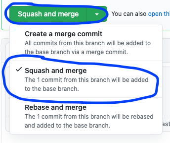

# NEO React Library PR best practices

This is the "living document" that describes the teams agreed upon bets practices. It is part of the repo so that, as this doc changes, it's changes are logged and agreed upon by the members of the team.

## the "must dos"

- `>=2` dev approvals before merging
- `>=1` UX approval if any UX has changed
- `<1000` lines of code per PR
- keep the repo clean by **deleting your branch after merging**
- if you've added tests, show the output of the tests (image)
- if you've added functionality, show it (eg, [with a GIF](https://gifox.io/)/recording)
- prepend title with ticket number, eg: `NEO-420 // do the thing`
- use JSDoc comments often; all exported components **must** have JSDoc comments ([see here for an example](https://github.com/joe-s-avaya/neo-library-react/blob/main/src/components/Switch/Switch.tsx))
- all PRs that adjust UX _must_ describe exactly how/why their work is accessible and include descriptions of the resources on how they know it is (gifs, articles, wcag docs, ect)
- "squash and merge" your branch into `main` 

## the "good ideas"

- aim for <400 lines of code per PR (<200 is possible)
- check in early, request reviews early
- if you will be making 5+ changes/check-ins to your PR, close it and then re-open it when you believe it will be ready for merging
- - this helps reduce netlify cost due to "build minutes"

